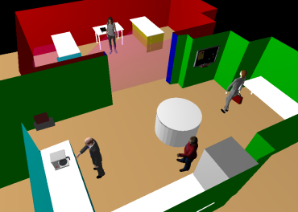
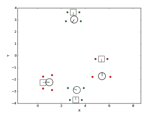

08/08/2017

# My progress

In the last weeks I have been working on different topics. First of all, I have corrected some bugs in the code which ensured a progress in the development.  Also, I have worked on a new method that allows the robot to avoid persons who are trying to interact with objects.

#### Problems fixed

Several problems have been solved, such as the removing of nodes from the free space graph without their subsequent retrieval, or that the Trajectory component ceased to function with moving people.

The problem with the Trajectory component appeared when we tried to modify an InnerModel previously modified. It is modified every time a person change its position in order to include their personal space within model, as explained in my last post. 

A new issue was raised by solving this problem. The nodes removed from the free space graph were not inserted back again. This nodes are removed to consider the personal space of the human as occupied.
 
This is a big issue, the human moves throughout the room all the nodes of the graph would disappear. The robot would not be able to move because it uses the graph in the path planning.

To fix this problem I realised that deleting the nodes was not necessary. It was only required to delete the edges that joint these nodes. Saving the deleted edges and inserting them again the next time the function is called, the issue is not raise anymore.

The next video shows the edges recovery in the free space graph of the Trajectory component: 

In the lower left corner we can see how a person moves around the room. The video shows the reappearance of the edges of the graph once the person has moved. The personal space of the human is represented in yellow.

We are currently working on solving another issue caused by the unconnected zones within the free space graph, caused by the presence of humans in the environment. When the robot has to navigate between unconnected regions, it uses the RRT path planning which takes too much time in findind a path. To avoid that, our plan is to change the free space graph, turning it into a regular grid. This may solve that problem.  

Also, the Social Navigation component is being changed in order to improve it. 

### Interaction with objects

Besides fixing errors, I have been working on the interaction with objects. It has consisted of providing their own space to the objects which humans often interact with (e.g: a coffee machine, a fridge, a computer...). 

First of all, a set of objects has been inserted in the model. I have created a new structure to save the pose and orientation of the objects. This structure also stores one value that indicates the interaction space, which is the space required to interact with the object. That will allow having different spaces for different objects, for example, to use a coffee machine we need less space than we need to read a poster, because we can do it from a farther distance.

I have chosen a trapezoid to delimit the area of each object within the environmet. However, it would be inappropriate to establish this space always as occupied because if we have too much objects in the room, the robot wouldn't be able to move. So we need certain conditions: the first one is that the person has to be inside this space to consider it as occupied; the second one, the person has to look at the object, otherwise there wouldn't be an interaction.

In the first picture we can see four objects (a coffee machine, a fridge, a phone, and a pin board) and four humans in different positions close to these objects. 

The position of the humans, the objects and the shapes of the space created for these objects are shown in the second picture. The shapes are shown in green if the space is being consider as free. Notice that these spaces are in green even if the person is inside it but is not looking at the object. If the shapes are red means that the person is inside the object's space and looking at it, so the space is considered as occupied.  

&nbsp; &nbsp; &nbsp; &nbsp;  &nbsp; &nbsp; &nbsp; &nbsp; &nbsp;  

* * *
Araceli Vega Magro
