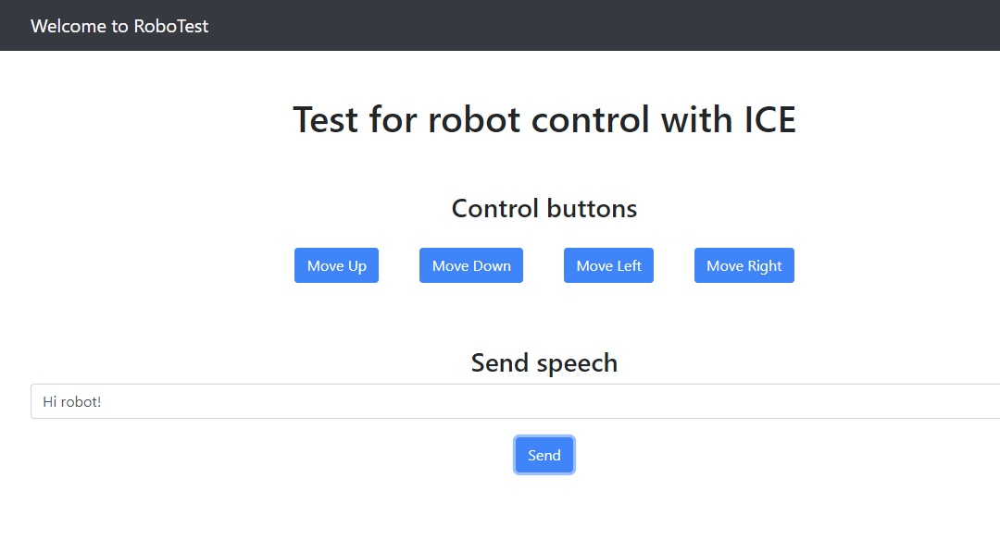
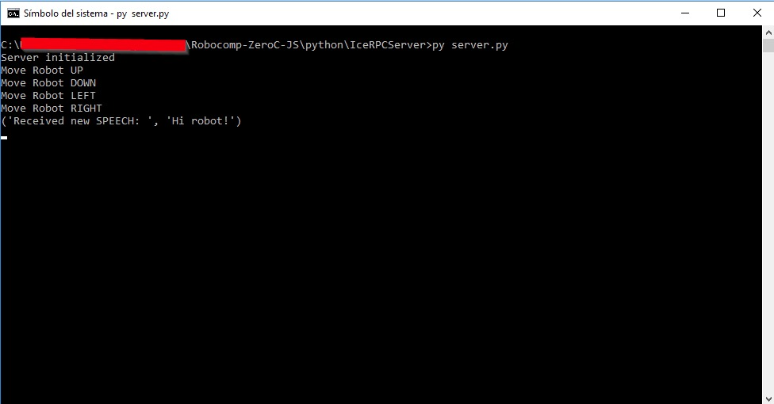

# First Web application ZeroC Ice

Jul 10, 2018

## Introduction

In the previous posts we showed how to implement Javascript client in NodeJS. This time we are implementing a new client, using a new interface file. This client is a web application that uses ZeroC Ice.

## Interface

First thing to do is create a new interface file, adding new methods:

```
module RPCConection {

    interface RobotServer {
        int printUp();
        int printDown();
        int printLeft();
        int printRight();
        int printSpeech(string name);
    };

};
```

## Server

The server side has been developed using Python. For this part we had to define the new methods of the interface:

```
   def __init__(self):
        print ("Server initialized")

    def printUp(self, current=None):
        print("Move Robot UP")
        return 1

    def printDown(self, current=None):
        print("Move Robot DOWN")
        return 1

    def printLeft(self, current=None):
        print("Move Robot LEFT")
        return 1

    def printRight(self, current=None):
        print("Move Robot RIGHT")
        return 1

    def printSpeech(self, text, current=None):
        print("Received new SPEECH: ", text)
        return 1
```

## Client

Once we have the Interface file and the server running, we create the client in Javascript, which will be a very basic application using Bootstrap and Jquery.

First of all we create a basic structure:

```
css/          # app global css variables and theme
js/           # app global javascript file
interface/		# Interface file definition
vendor/       # shared module (common frameworks) 
gulpfile.js		# toolkit for automating painful or time-consuming tasks in your development
index.html    # html entry point
```

Once the structure of our project is created, we would like to point out its most important aspects.

### index.html

Index.html contains five buttons that calls to our app.js file. These functions will be used to call the methods defined on the interface. The first four buttons are going to move the robot in the four directions left, right, up and down. The last button is there to set the speed.

```
<button type="button" onclick="moveUp();" class="btn btn-primary arrow">Move Up</button>
<button type="button" onclick="moveDown();" class="btn btn-primary arrow">Move Down</button>
<button type="button" onclick="moveLeft();" class="btn btn-primary arrow">Move Left</button>
<button type="button" onclick="moveRight();" class="btn btn-primary arrow">Move Right</button>
```

On the other hand, one of the most important parts of our index.html file is the inclusion of the Scripts for the correct use of ZeroC Ice. For this we first include the Ice.js and the interface file already converted to Javascript.

```
<script src="https://cdnjs.cloudflare.com/ajax/libs/ice/3.7.1/Ice.js"></script>
<script src="./interface/RPCConection.js"></script>
```

### app.js

This file initializes Ice and set the connection through the proxy using WebSocket and not TCP, on port 9000.

```
const communicator = Ice.initialize();
const proxy = communicator.stringToProxy("RPCServerName:ws -h localhost -p 9000");
```

Now we define the functions that are called from the Index.html when interacting with buttons.

```
async function moveUp() {
    try {
        const test = await RPCConection.RobotServerPrx.checkedCast(proxy);
        await test.printUp();
    }
    catch (ex) {
        console.log(ex.toString());
    }
    finally {
        // if (communicator) {
        //     return communicator.destroy();
        // }
    }
}

async function moveDown() {
    try {
        const test = await RPCConection.RobotServerPrx.checkedCast(proxy);
        await test.printDown();
    }
    catch (ex) {
        console.log(ex.toString());
    }
    finally {
        // if (communicator) {
        //     return communicator.destroy();
        // }
    }
}

async function moveLeft() {
    try {
        const test = await RPCConection.RobotServerPrx.checkedCast(proxy);
        await test.printLeft();
    }
    catch (ex) {
        console.log(ex.toString());
    }
    finally {
        // if (communicator) {
        //     return communicator.destroy();
        // }
    }
}

async function moveRight() {
    try {
        const test = await RPCConection.RobotServerPrx.checkedCast(proxy);
        await test.printRight();
    }
    catch (ex) {
        console.log(ex.toString());
    }
    finally {
        // if (communicator) {
        //     return communicator.destroy();
        // }
    }
}

async function sendSpeech() {
    try {
        const test = await RPCConection.RobotServerPrx.checkedCast(proxy);
        await test.printSpeech(document.getElementById("speech").value);
    }
    catch (ex) {
        console.log(ex.toString());
    }
    finally {
        // if (communicator) {
        //     return communicator.destroy();
        // }
    }
}
```

## Conclusion

To finish, we launch our web application using our Gulp tool. Gulp.js is a build system that allows you to automate common development tasks, such as minifying JavaScript code, reloading the browser, compressing images, validating code syntax, etc.
Therefore, we now proceed to verify that it connects perfectly to our server in Python, and we obtain the expected behavior when pressing the different buttons.
The next step, will be try to get to move the robot’s base.

 

 


