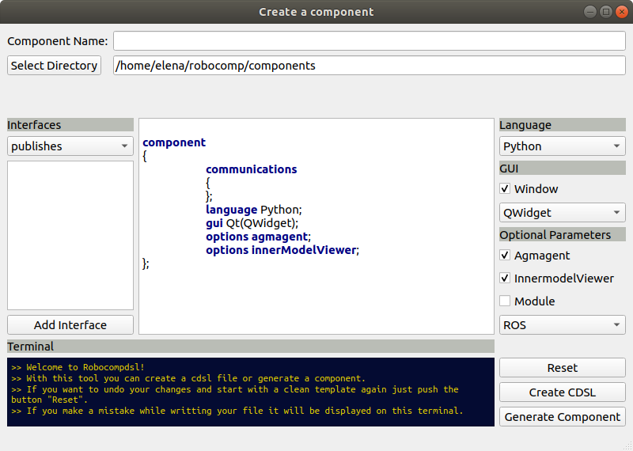

# First Graphical Interface version and implementation of highlighter

The previous version of robocompdsl-gui had some shortcomings, so we have restructured the new version to include all the possible options. The layout was divided in the following parts:

- At the top of the windows we placed 2 line editors to insert the name of the component and the directory to save the new cdsl file.
- On the left section we can find the options related to the interfaces, including communication type, a list with all interfaces and an "add" button that still must be discused.
- The central part has the main text editor to write the cdsl file. It is initialized with some of the keywords and the user should be able to add code both writting and clicking the different options of the graphical interface.
- On the right side the rest of the parameters can be configured. It includes language, gui and optional features selection.
- At the bottom of the window we placed a terminal to bring the user a feedback with information and errors and we can also find the creation buttons. In our GUI version the user has the possibility to reset the template, create a cdsl file or generate a component directly.

**Higlighter**

We have also developed a highlighter for the main text editor, so that the user can easily recognize the correct keywords. These keywords are highlighted in bold and a different color.

**Other implementations**

We are coding the robocompdsl-gui core at the moment. The list of completed tasks is listed below:
- Entering the component name and directory already allow to create a cdsl file.
- The user can modify the main text editor with the highlighter fully working.
- The user can change language using the combo box.
- The user can select/deselect "window", "agmagent" and "innerModelViewer" parameters, including the corresponding code in the main editor.

