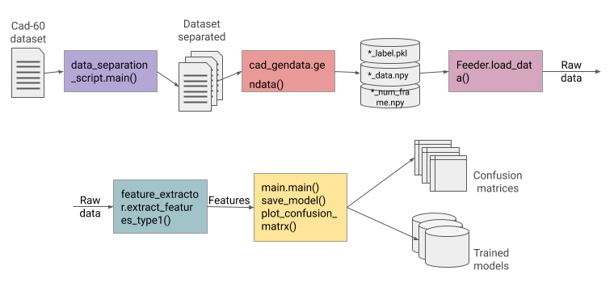

# Classifying CAD-60

June 22, 2019

For the first sprint we agreed that I should start with the hand-crafted features and frame by frame classification, following the approach of Diego's research on human activity recognition. Human activity recognition is usually exploiting either the information from the detected human joints (the set of human joints relating to one person is further referred to as a skeleton), their spatial position and temporal change, or rgb data direcly. Our project follows the former approach. The goal of this phase was to construct a training pipeline, which would include: dataset preparation, skeleton reading from txt files, feature extraction, classifier fitting and evaluation.

## Pipeline

This is is the simplified illustration of the resulting pipeline.   

The first step is distribution of the dataset according to the groups of activities (environments) according to the evaluation protocol of CAD-60 (environments are: office, bathroom, bedroom, living room and kitchen). [Dataset Link](http://pr.cs.cornell.edu/humanactivities/data.php)  
The next step is reading the text files with the information about the joints positions in different points in time during capturing of a certain activity. The data is read and saved locally as .npy files and corresponding labels as .pkl files.  
The saved files are then loaded into numpy arrays and used for feature extraction and fitting classifiers.
A very simple and small set of features was selected for this first iteration of activities classification. However, the tools module serving as a library for features includes more functions for feature extraction than are currently used. They will be used at a later phase.  
Finally, an SVM classifier of scikit-learn library was used to classify the samples. The main module also produces an accuracy report and confusion matrices.     

## Evaluation

The evaluation protocol for the selected dataset implies a kind of a leave-one-out-cross-validation (LOOCV), where 'one' stands not for one sample but for all samples related to one person performing all actions. We, therefore, train on 3 out of 4 subjects at a time and validate on the remaining one. For this, custom cross-validation strategy was implemented.  
The resulting mean accuracy is 60%. This is the weighted average for all environments.  
Mean accuracies across the environments range from 41% to 67%.       

## Summary and further steps

Confusion matrices show that activities that significantly differ from the other activities are classified relatively well, whereas certain similar actions, such as rinsing mouth with water and brushing teeth can be completely mistaken for one another. This may be an indication of the insufficiency of discriminating features. Therefore, the next stage should be concerned with selection of features, which would give robust classification results, as well as trying other classification approaches.   

***
MF
