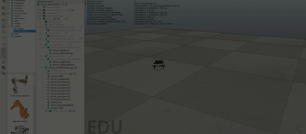

# differentialrobotVREP and keyboardrobotcontroller Component

15th August, 2019

This post will describe how to create **differentialrobotVREP** component and implementing various functionalities to it. It will also describe how to control the differentialrobot using keyboardrobotcontroller component.

## keyboardrobot controller client component

This component allows user to interact with differentialRobot(being simulated on V-REP) using arrow keys on keyboard. The below gif shows the key pressed on terminal and the corresponding response of robot that is simulated in V-REP.

**NOTE**: One can also use [joystickComp](https://github.com/robocomp/robocomp-robolab/tree/master/components/joystickComp) and [keyboardrobotcontroller](https://github.com/robocomp/robocomp-robolab/tree/master/components/keyboardrobotcontroller) components found in https://github.com/robocomp/robocomp-robolab/tree/master/components as client with **differentialrobotVREP** as server. But, I have used  [keyboardrobotcontroller](https://github.com/robocomp/robocomp-robolab/tree/master/components/keyboardrobotcontroller) component of robocomp-robolab component as it is with just changing port in etc/config file for testing. I will be explaining how to change the port in forthcoming sections.




The following are the some of the functionalities of keyboardrobotcontroller component:

- Increase/decrease advancing speed of the robot:

If user presses either the 'UP' or the 'DOWN' arrow key on keyboard, the component increases or decreases the forward speed of the robot by 20 units. But if the speed reaches some set maximum limit than no change to speed occurs on pressing keys. 

- Increase/decrease rotating speed of the robot:

If user presses either the 'RIGHT' or the 'LEFT' arrow key on keyboard, the component increases or decreases the rotating speed of the robot by 0.1 units. But if the rotating speed reaches some set maximum limit than no change to speed occurs on pressing keys.

- Quitting the client:

On pressing 'q' button of the keyboard the client component ends the session.

## Creating the components

Now I will discuss the dependencies of each of these components and the interfaces which can be used by other components to interact with it.

**differentialrobotVREP.cdsl**
```
import "DifferentialRobot.idsl";

Component differentialrobotVREP
{
    Communications
    {
        implements DifferentialRobot;
    };	

	language python;
};
```

So as we can see the differentialrobotVREP component is not dependent on any other component. However it has 8 different methods which can be used by other components for communication. These are described in the following IDSL file.

**DifferentialRobot.idsl**
```
import "GenericBase.idsl";

module RoboCompDifferentialRobot
{
  struct TMechParams
  {
    int wheelRadius;
    int axisLength;
    int encoderSteps;
    int gearRatio;
    float temp;
    string device;
    string handler;
    float maxVelAdv;
    float maxVelRot;
  };

  interface DifferentialRobot
  {
    void getBaseState(out RoboCompGenericBase::TBaseState state) throws RoboCompGenericBase::HardwareFailedException;
    void getBasePose(out int x, out int z, out float alpha) throws  RoboCompGenericBase::HardwareFailedException;
    void setSpeedBase(float adv, float rot) throws RoboCompGenericBase::HardwareFailedException;
    void stopBase() throws RoboCompGenericBase::HardwareFailedException;
    void resetOdometer() throws RoboCompGenericBase::HardwareFailedException;
    void setOdometer(RoboCompGenericBase::TBaseState state) throws RoboCompGenericBase::HardwareFailedException;
    void setOdometerPose(int x, int z, float alpha) throws RoboCompGenericBase::HardwareFailedException;
    void correctOdometer(int x, int z, float alpha) throws RoboCompGenericBase::HardwareFailedException;
  };
};
```

Now moving forward to the client component. It is the main component which the user will interact with. Here is the cdsl file for the same.

**keyboardrobotcontroller.cdsl**
```
import "/robocomp/interfaces/IDSLs/DifferentialRobot.idsl";

Component keyboardrobotcontroller
{
        Communications
        {
                requires DifferentialRobot;
        };
        language Python;
};
```

This component takes the keyboard input from the user's device and performs the logic to increase/decrease advance/rotation speed accordingly by communicating with the client (here, it is differentialrobotVREP component). Specifically, the components uses **setSpeedBase** interface offered by the differentialrobotVREP component.

## Testing the Component

1. Copy the [differentialrobotVREP](https://github.com/nikhil3456/V-REP/tree/keyboardRobotController/components/keyboardRobotController/differentialrobotVREP) component and [keyboardrobotcontroller](https://github.com/robocomp/robocomp-robolab/tree/master/components/keyboardrobotcontroller) from [robocomp-robolab/tree/master/components/](https://github.com/robocomp/robocomp-robolab/tree/master/components/) inside your local copy of robocomp/components/.

2. open this config file: ~robocomp/components/differentialrobotVREP/etc/config in your favourite editor.
3. copy, the port on which the server port endpoints for interfaces are implemented.
4. open this config file: ~robocomp/components/keyboardrobotcontroller/etc/config in your favourite editor.
5. paste, the port(copied in step-2) in DifferentialRobotProxy port for required interfaces replacing 0.

**NOTE:** One can also use [joystickComp](https://github.com/robocomp/robocomp-robolab/tree/master/components/joystickComp) component found in https://github.com/robocomp/robocomp-robolab/tree/master/components in place of [keyboardrobotcontroller](https://github.com/robocomp/robocomp-robolab/tree/master/components/keyboardrobotcontroller) in step-1 for testing.

**NOTE:** The Scene file can be found [here](https://github.com/nikhil3456/V-REP/blob/keyboardRobotController/components/hexapod/ePuck_test.ttt).

-----------------------------------------------------or--------------------------------------------------------------

My current repository can be found [here](https://github.com/nikhil3456/V-REP/tree/keyboardRobotController/components/keyboardRobotController). For testing copy the folder *keyboardRobotController* inside robocomp/components/. And the scene file can be found [here](https://github.com/nikhil3456/V-REP/blob/keyboardRobotController/components/hexapod/ePuck_test.ttt).


```
cd robocomp/components/keyboardRobotController
```
Open 3 new terminals.

Terminal 1: 
```
1. Open the scene ePuck_test.ttt in V-REP.
2. Now, start the scene. That will start the server at port 19999.
```

Terminal 2:
```
cd differentialrobotVREP
python src/differentialrobotVREP.py --Ice.Config=etc/config
```

Terminal 3: 
```
cd keyboardrobotcontroller
python src/keyboardrobotcontroller.py --Ice.Config=etc/config
```


Now, switch to terminal-3 and press the arrow keys on keyboard. One can now see the robot moving according to the keys being pressed from the keyboard. Use the 'q' button on keyboard to end the client session. 

*PS: I would like to express my sincere gratitude to my project mentors Pablo Bustos, Nicolás González Flores, and José Manuel Agúndez for being very supportive and helping me whenever I faced any problem.* 


* * *
Nikhil Bansal
