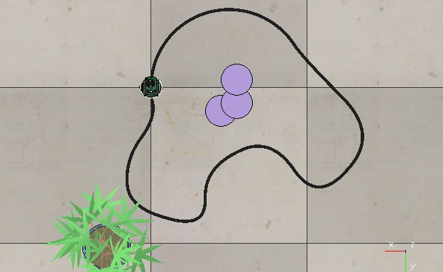
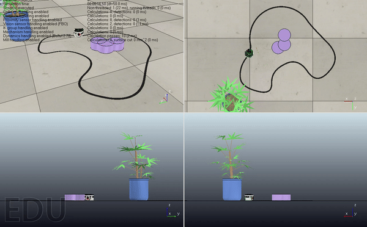

# linefollowingVREP Component

24th August, 2019

This post will describe how to create **linefollowingVREP** component and implementing various functionalities to it. This component will serve as client to cameraVREP and differentialRobotVREP components and thus communicates with each of them to make the differential robot follow a path.

## linefollowingVREP controller

This component communicates with cameraVREP component to get images of the floor (floor is in the scene simulated on V-REP). And, using that image it determines the directions to move so as to follow the path on the floor.
The below image shows the V-REP scene with the black-colored path drawn on the floor:



The compute method in specificworker.py file of linefollowingVREP component calls the **getImage()** method of cameraVREP component to get the image of the floor(simulation on V-REP), which looks like:


Using the image (which looks like above image), linefollwingVREP component determines which direction to move, for example:
- if the black patch is in the center of image (as in the above image), implies robot has to move straight.
- if the black patch is in the right of image, implies robot has to turn right.
- if the black patch is in the left of image, implies robot has to turn left.

to turn to the determined direction, linefollowingVREP component calls the **setSpeedBase(self, adv, rot)** method of differentialrobotVREP component.

The code for the above logic looks like this:

```python
data = self.camerasimple_proxy.getImage()
arr = np.fromstring(data.image, np.uint8)
img = np.reshape(arr, (data.width, data.height, data.depth))

lightSens = [img[0, 1, 1], img[0, 7, 1], img[0, 14, 1]]
v = 44
omega = 0
if lightSens and ((lightSens[0]<50)or(lightSens[1]<50)or(lightSens[2]<50)):
    if (lightSens[0]<50):
        omega = 0.7
    if (lightSens[2]<50):
        omega = -0.7
else:
    v=44
    omega=0

self.differentialrobot_proxy.setSpeedBase(v, omega)

```
And, here is the gif to show the robot following the line on the floor:




## Creating the components

Now I will discuss the dependencies of each of these components and the interfaces which can be used by other components to interact with it.

### First, lets discuss the server components for our linefollowingVREP component:

- differentialrobotVREP component:

    **differentialrobotVREP.cdsl**
    ```
    import "DifferentialRobot.idsl";

    Component differentialrobotVREP
    {
        Communications
        {
            implements DifferentialRobot;
        };	

    	language python;
    };
    ```

    So as we can see the differentialrobotVREP component is not dependent on any other component and it will be used as a server. However it has 8 different methods which can be used by other components for communication. These are described in the following IDSL file.

    **DifferentialRobot.idsl**
    ```
    import "GenericBase.idsl";

    module RoboCompDifferentialRobot
    {
      struct TMechParams
      {
        int wheelRadius;
        int axisLength;
        int encoderSteps;
        int gearRatio;
        float temp;
        string device;
        string handler;
        float maxVelAdv;
        float maxVelRot;
      };

      interface DifferentialRobot
      {
        void getBaseState(out RoboCompGenericBase::TBaseState state) throws RoboCompGenericBase::HardwareFailedException;
        void getBasePose(out int x, out int z, out float alpha) throws  RoboCompGenericBase::HardwareFailedException;
        void setSpeedBase(float adv, float rot) throws RoboCompGenericBase::HardwareFailedException;
        void stopBase() throws RoboCompGenericBase::HardwareFailedException;
        void resetOdometer() throws RoboCompGenericBase::HardwareFailedException;
        void setOdometer(RoboCompGenericBase::TBaseState state) throws RoboCompGenericBase::HardwareFailedException;
        void setOdometerPose(int x, int z, float alpha) throws RoboCompGenericBase::HardwareFailedException;
        void correctOdometer(int x, int z, float alpha) throws RoboCompGenericBase::HardwareFailedException;
      };
    };
    ```

    As you can see in the above idsl file, the differentialrobot offers an interface **setSpeedBase** . We will use this interface to change the direction of robot and to move the robot in our linefollowingVREP component.

- cameraVREP component
  

**cameraVREP.cdsl**
```
import "CameraSimple.idsl";

Component cameraVREP
{
    Communications
    {
        implements CameraSimple;
    };
        language python;
};
```

So as we can see the cameraVREP component is not dependent on any other component and it will be used as a server. However it has 1 method which can be used by other components for communication. These are described in the following IDSL file.

**CameraSimple.idsl**
```
module RoboCompCameraSimple
{
  exception HardwareFailedException { string what; };

  sequence<byte> ImgType;

  struct TImage
  {

    int width;
    int height;
    int depth;
    ImgType image;
  };


  interface CameraSimple
  {
    idempotent void getImage(out TImage im) throws HardwareFailedException;
  };
};
```

As you can see in the above idsl file, that the CameraSimple offers an interface **getImage** . We will use this interface to get the image of the floor and then using that image determine the direction in which to move the robot in our linefollowingVREP component.

### Now moving forward to the client component. It is the main component which will implement the logic for the robot to follow a path. Here is the cdsl file for the same.

**linefollowingVREP.cdsl**
```
import "DifferentialRobot.idsl";
import "CameraSimple.idsl";
import "Laser.idsl";

Component linefollowingVREP
{
    Communications
    {
        requires DifferentialRobot;
        requires CameraSimple;
        requires Laser;
    };

    language python;
};
```
As explained earlier, this component communicates with cameraVREP component to get images of the floor (floor is in the scene simulated on V-REP). And, using that image it determines the directions to move so as to follow the path on the floor.

## Testing the Component

My current repository can be found [here](https://github.com/nikhil3456/V-REP/tree/lineFollowingComponent/components/lineFollower). For testing copy the folders *cameraVREP*, *differentialrobotVREP*, *linefollowingVREP* inside robocomp/components/. And the scene file can be found [here](https://github.com/nikhil3456/V-REP/blob/lineFollowingComponent/components/hexapod/lineFollowerDemo.ttt).

**NOTE**: I have used the same *differentialrobotVREP* component as the one I used with *keyboardcontroller* component with no change. I only changed the port in etc/config.


```
cd robocomp/components/
```
Open 4 new terminals.

Terminal 1: 
```
1. Open the scene lineFollowerDemo.ttt in V-REP.
2. Now, start the scene. That will start the server with two socket at 19999, 19997.
```

Terminal 2:
```
cd differentialrobotVREP
python src/differentialrobotVREP.py --Ice.Config=etc/config
```

Terminal 3: 
```
cd cameraVREP
python src/cameraVREP.py --Ice.Config=etc/config
```

Terminal 4: 
```
cd linefollowingVREP
python src/linefollowingVREP.py --Ice.Config=etc/config
```


Now, switch to the V-REP simulator and see the robot moving following the path on the floor.

*PS: I would like to express my sincere gratitude to my project mentors Pablo Bustos, Nicolás González Flores, and José Manuel Agúndez for being very supportive and helping me whenever I faced any problem.* 

* * *
Nikhil Bansal
