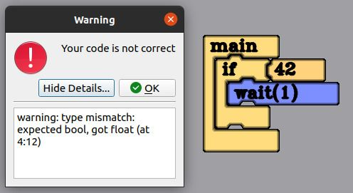

First coding period
===================

This period has been up for almost a full month. During these weeks, I've got
the chance to discover the inner workings of LearnBlock, adapt to working in a
public project, communicate with my mentors and (finally!) write code and
implement features.

Communication and collaboration
-------------------------------

During the first days, I didn't have much idea about where should I start.
Yes, I've had previously submitted a PR making simple changes to the parser,
but it was not enough. Fortunately, my mentors where very helpful: they
provided constant guidance through my first big changes, and gave me useful
hints for speeding up debugging and prototyping.

I think this goes in line with what makes the Open Source community great:
you don't have to work alone, because you get to know people which makes your
journey a bit easier.

Little improvements
-------------------

I began making little incremental changes, just to make further modifications
easier:

- An **status interface** was defined to standarize communication between the
  parser producing the diagnostics and the frontend consuming them. Right now
  it handles severity (like _warning_, _info_, or _error_), location and a
  hardcoded message. It can change in the future, but right now it is
  descriptive enough to allow for simple error reporting.

- The parser was cleaned, removing redundant grouping and making the operator
  subexpressions explicit. Before, they were just a string of tokens (so
  precedence was tied to Python's rules). After these changes, grouping was
  made explicit and the grammar was made more flexible by allowing for
  different precedence rules and operators than the ones you can find in
  Python.

Parser overhaul
---------------

At some point during these changes, right before trying to implement a
typechecker, I've noticed that it was going to take quite a bit of effort to
handle all the different nuances in the behavior of each node. The entire code
generation was procedural, with some global variables which made difficult to
follow the flow of the program state.

I decided to turn it into a little class hierarchy, where each node was an
instance of a class, in turn descendant from a generic Node class. There were
lots of advantages supporting this transition:

- Behavior could be close to the data being handled, as each class had its own
  methods which could override defaults. This makes understanding the program
  logic easier, as you knew easily which method was tied to which kind of node,
  and which properties did it have available for you to use.

- For lots of node types, code could be reused, as sane defaults were provided
  in the parent class and children could choose not to override them.

- It got rid of the "global state" problem by encapsulating it inside a
  Context. The context had to be passed explicitly, so it was easy to keep
  track of what was being changed at any point.

After doing these changes, I've asked my mentors for feedback. They liked the
changes, so I could now focus on the new feature...

The typechecker
---------------

This was one of the deliverables proposed. The typechecker takes a parsed
syntax tree and checks for every subexpression if the inferred type matches the
expected one (both parameters and the return type). The types added are simple,
_number_, _string_ and _bool_.

Testing and final touches
-------------------------

Even if testing and implementation were done at the same time, I wanted to
check it thoroughly. I've ran both the upstream parser and my version, trying
to generate Python code and look for differences. The generated code was always
equivalent, but now errors could be detected and located!

I showed these results with my mentors, and made a PR which got merged
afterwards.

