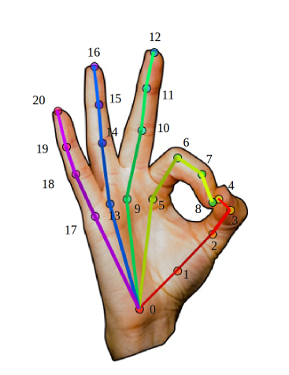

# Keypoint Detection from detected hand

July 20, 2020

In last article I discussed about detecting hand's bounding box in an input image feed. Now next step for detecting hand gestures is to detect keypoints of the detected hands. In this article, I will discuss techniques used by me to find out hand keypoints. I will also talk about efficiency and accuracy of different techniques I used.

Hand Keypoints is one way to describe hand pose. It consists of 21 coordinates per hand, where four points describe each finger (4\*5) and last one describe wrist coordinate. The below diagram deccribes position of each coordinate.

I used two state of the art techniques to find hand keypoints *i.e Openpose and Mediapipe*. I will elaborate on these techniques in subsequent sections.

## Openpose

Openpose is CMU's open source library which is used to detect human body pose. It has ability to detect 125 full body points consisting of body, face, hand and foot. Openpose is developed after training neural networks on huge datasets. It also provides standalone Python API to detect keypoint in any specif part of body. I used Openpose's Python API to enable hand keypoint detection in *HandKeypoint Component*.

Talking about efficiency, openpose gives a response time of 9-10 FPS (frames per second) when run on GPU. It can perform even better when run on system with better GPU configurations. Openpose hand Keypoint is really accurate and takes care of occulusions pretty well. It also gave decent results in unsual backgrounds (like bright light).

Besides hand keypoint detection, openpose have extensive use cases. To learn more about openpose visit [Openpose](https://github.com/CMU-Perceptual-Computing-Lab/openpose).

## Mediapipe

Most of basic details about mediapipe were already discussed in the last blog. Mediapipe have a **Hand Landmark Model** which is used to predict 21 hand coordinates discussed above. Mediapipe uses direct coordinate prediction (via regression). The model learns a consistent internal hand pose representation and is robust even to partially visible hands and self-occlusions. Model was trained on over 30K real world images which were annotated manually. To better cover the possible hand poses and provide additional supervision on the nature of hand geometry, mediapipe also render a high-quality synthetic hand model over various backgrounds and map it to the corresponding 3D coordinates.

I used pretrained model for hand lankmark prediction to detec hand Keypoints. This was done in *HandGestureClient Component* because a lot of step were overlapping with that of bounding box detection and there is no point in performing redundant calculations.

Mediapipe is much better than openpose in terms of speed and have response time of 9-10 FPS on CPU. Accuracy is similar to that of openpose.

## Try it out!

For experiencing this yourself, visit [handGestureClient Component](https://github.com/Kanav-7/robocomp-robolab/tree/master/components/detection/test/handGestureClient) and [handKeypoint Component](https://github.com/Kanav-7/robocomp-robolab/tree/master/components/detection/handKeypoint) and follow the the given instructions.

## What's Next?

Now as I have obtained hand keypoints using bounding box of the hand, next step is to train models to recognize hand gestures with the help of bounding box and detected keypoints. This part of project will be implemented in *HandGesture Component*.

***

**Kanav Gupta**
