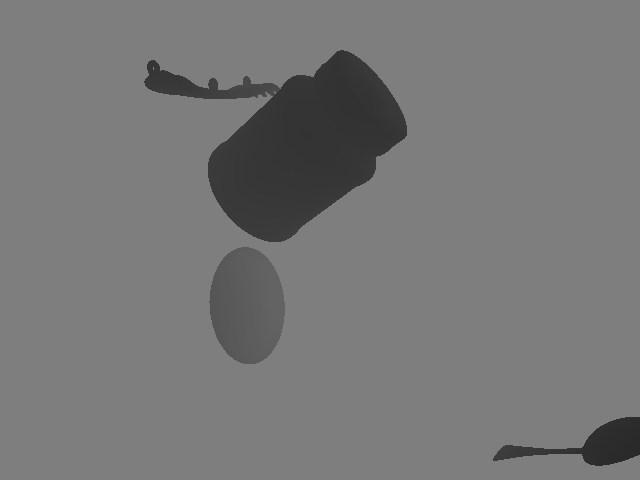
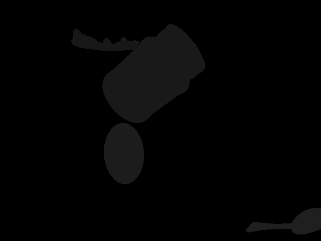

# Complete Work Pipeline

_DATE : June 22, 2020_

In this post, I share the recent updates of our work, along with some results.
Also, I define the detailed strategy and work pipeline.

## Workflow

-   Complete [Segmentation-driven 6D Object Pose Estimation](https://arxiv.org/abs/1812.02541) implementation.

-   Initially train and evaluate the network on [YCB-Videos](https://rse-lab.cs.washington.edu/projects/posecnn/) dataset.

-   Collect RGBD data of household objects from CoppeliaSim simulator for data augmentation.

-   Re-train the network on augmented dataset, that contains all the target objects.

-   Tune the network and improve its performance, with the following suggestions :
    -   Use focal loss for segmentation.
    -   Tune hyperparameters with values in the original paper.
    -   Use weighted masks for segmentation.

-   In case the network doesn't perform as expected, the following suggestions can be considered :
    -   Add a classical iterative refinement module on top of the network, to refine the predicted poses, when accuracy is critical.
    -   Consider a DNN approach with refinement module, especially [DenseFusion](https://arxiv.org/abs/1901.04780).

-   Complete the pose estimation component that gets objects' poses from RGB image using the trained deep neural network.

-   Integrate the pose estimation component with grasping components through the new _CORTEX_ architecture.

-   Test and analyse the grasping performance with DNN-based pose estimation.

## Work Pipeline

The complete work pipeline of grasping goes as follows :

-   RGB signal is continuously captured from the robot head camera.

-   The signal is passed to the pose estimation component.

-   The component runs network inference and gets the poses of the objects in the scene.

-   These poses are, then, passed to the grasping components.

-   The grasping components move the robot arm, until it's aligned with the pose of the desired object.

-   In the approach stage, if the poses aren't accurate enough, the following occurs :
    -   The grasping components call the pose estimation component again.
    -   The pose estimation component performs classical iterative refinement over the estimated poses.
    -   The accurate poses are sent back to the grasping components.

## Recent Updates

-   My main concern, at the beginning, was to finish [Segmentation-driven 6D Object Pose Estimation](https://arxiv.org/abs/1812.02541) implementation. This architecture is a good choice in our case, as it's fast, accurate, simple and easily integrable with classical methods. The original implementation doesn't have the backpropagation and training code, so I have to refactor the original implementation and implement the remaining parts. Fortunately, the paper shows the training details, which helped me complete a full implementation that can be found [here](https://github.com/robocomp/grasping/tree/master/segmentation-based-pose).

-   Afterwards, I started training the network on [YCB-Videos](https://rse-lab.cs.washington.edu/projects/posecnn/) dataset, as it's the most diverse open-source dataset. Starting the training, I was able to discover some issues with the implementation, which I solved and added more evaluation scripts.

-   As expected, the initial network training wasn't sufficient, as the network wasn't able to identify unseen object, so I have to augment the training dataset with more objects to fit our needs.

-   Consequently, I started developing a data collector, that collects and labels data of more custom objects from CoppelaSim simulator. Here are the challenges about such data collector and how I was able to solve them :
    -   I used some open-sources 3D models of household objects. These objects come with different scales and aligned axes, which makes their usage inconsistent. Consequently, I used _Blender_ to unify the scale and axes, in order to automate the process of data collection and labeling.
    -   For each data sample, there are two required types of labels, which are segmenatation masks and 6D poses. I needed a large number of data samples (around 15000 samples), so I had to find a way to automate the data collection and labeling. Fortunately, I was able to do so using `PyRep` API.
    -   Using `PyRep` API, I could get the objects' poses from the scene, with respect to world frame, in the form of translations and quaternions, from which I could get the _RT_ matrices. Also, using the poses, I could project the objects' 3D point cloud on the RGB image and get a contour around each object, from which I can get the segmentation labels.
    -   Using this method, I could augment the training dataset with 10 more custom objects. So, I have 31 training classes, in total. The data collector code can be found [here](https://github.com/robocomp/grasping/tree/master/data-collector).

-   Currently, the network re-train on augmented dataset is in progress. Then, it will be tested to explore further improvements.

-   Also, I have started exploring the possible implementations of the pose estimation component based on the new _CORTEX_ architecture

## Results

-   Initial network training :

Figure(1) : Output of initial network training.

This is an output sample from the initial training of the network.
We can see that the network needs more training on more objects, in order to recognize more objects and predict more precise poses.

-   Data collection :

The following is an output sample of data collection from CoppeliaSim simulator :
    

Figure(2) : RGB output of vision sensor.

Figure(3) : Depth output of vision sensor.

Figure(4) : Segmentation mask of RGB image.

Figure(5) : Visualization of object poses on RGB image.

## Important Dates

- __June 9, 2020 :__

Complete implementation of [Segmentation-driven 6D Object Pose Estimation](https://arxiv.org/abs/1812.02541).

Commit : https://github.com/robocomp/grasping/commit/3d629976f5c3fba4f66650ce7b10835092b94bbc

- __June 19, 2020 :__

Complete data collection and labeling code for data augmentation.

Commit : https://github.com/robocomp/grasping/commit/648ebf0d77d6f3f4b34ad99ff9fab929eebb1c2e

__Mohamed Shawky__