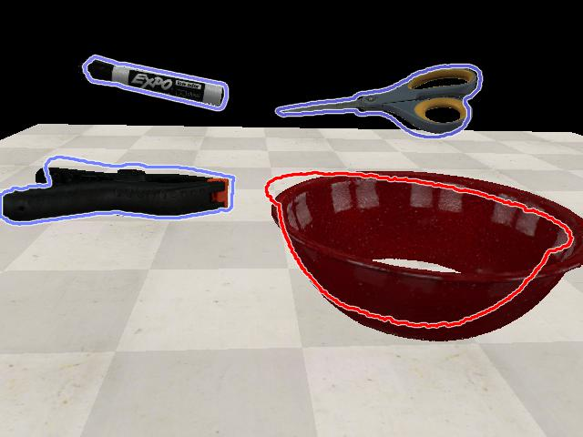
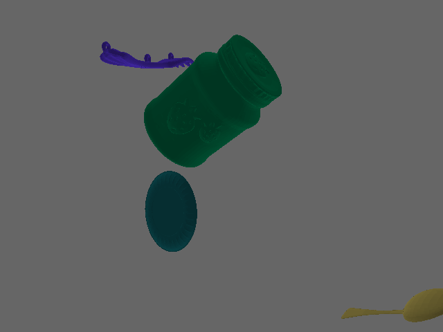
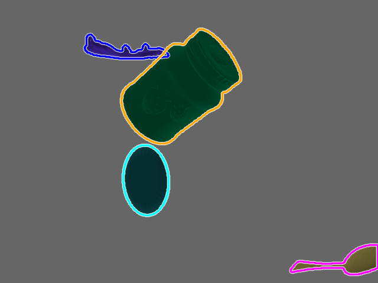

# Complete Work Pipeline

_DATE : June 22, 2020_

In this post, we share the recent updates of our work, along with some results.
Also, we define the detailed strategy and work pipeline.

## Workflow

-   Complete [Segmentation-driven 6D Object Pose Estimation](https://arxiv.org/abs/1812.02541) implementation.

-   Initially train and evaluate the network on [YCB-Videos](https://rse-lab.cs.washington.edu/projects/posecnn/) dataset.

-   Collect RGBD data of household objects from CoppeliaSim simulator for data augmentation.

-   Re-train the network on augmented dataset, that contains all the target objects.

-   Tune the network and improve its performance, with the following suggestions :
    -   Use focal loss for segmentation.
    -   Tune hyperparameters with values in the original paper.
    -   Use weighted masks for segmentation.

-   In case the network doesn't perform as expected, the following suggestions can be considered :
    -   Add a classical iterative refinement module on top of the network, to refine the predicted poses, when accuracy is critical.
    -   Consider a DNN approach with refinement module, especially [DenseFusion](https://arxiv.org/abs/1901.04780).

-   Complete the pose estimation component.

-   Integrate the pose estimation component with grasping components.

## Work Pipeline

The complete work pipeline of grasping goes as follows :

-   RGB signal is continuously captured from the robot head camera.

-   The signal is passed to the pose estimation component.

-   The component runs network inference and gets the poses of the objects in the scene.

-   These poses are, then, passed to the grasping components.

-   The grasping components move the robot arm, until it's aligned with the pose of the desired object.

-   In the approach stage, if the poses aren't accurate enough, the following occurs :
    -   The grasping components call the pose estimation component again.
    -   The pose estimation component performs classical iterative refinement over the estimated poses.
    -   The accurate poses are sent back to the grasping components.

## Recent Updates

-   [Segmentation-driven 6D Object Pose Estimation](https://arxiv.org/abs/1812.02541) implementation is finished.

-   The network is initially trained and tested on [YCB-Videos](https://rse-lab.cs.washington.edu/projects/posecnn/) dataset.

-   The code of data collection and labeling is finished.

-   The dataset is augmented with new objects.

-   The network re-train on augmented dataset is currently in progress.

-   The pose estimation component implementation is currently in progress.

## Results

-   Initial network training :

Figure(1) : Output of initial network training.

This is an output sample from the initial training of the network.
We can see that the network needs more training on more objects.

-   Data collection :

The following is an output sample of data collection from CoppeliaSim simulator :
    

Figure(2) : RGB output of vision sensor.

Figure(3) : Depth output of vision sensor.

Figure(4) : Segmentation mask of RGB image.

Figure(5) : Visualization of object poses on RGB image.

## Important Dates

- __June 9, 2020 :__

Complete implementation of [Segmentation-driven 6D Object Pose Estimation](https://arxiv.org/abs/1812.02541).

Commit : https://github.com/robocomp/grasping/commit/3d629976f5c3fba4f66650ce7b10835092b94bbc

- __June 19, 2020 :__

Complete data collection and labeling code for data augmentation.

Commit : https://github.com/robocomp/grasping/commit/648ebf0d77d6f3f4b34ad99ff9fab929eebb1c2e