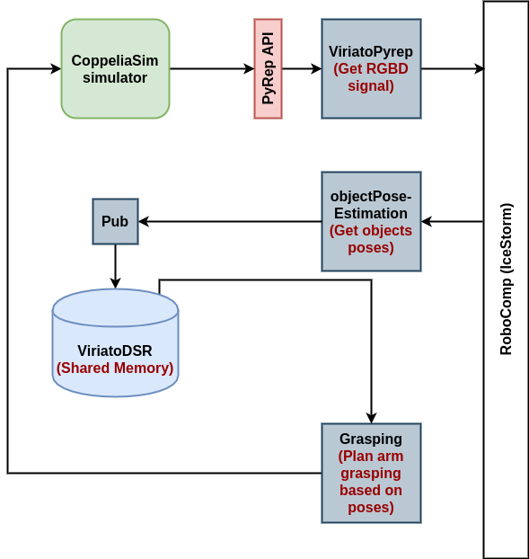
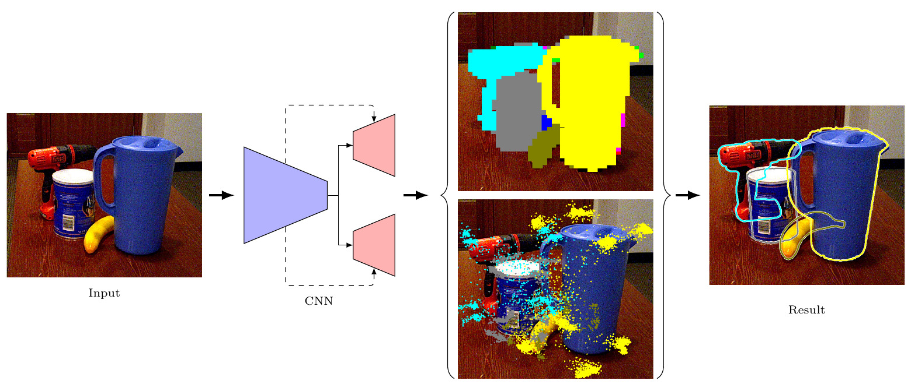
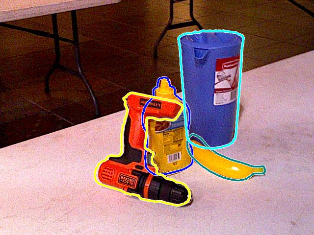
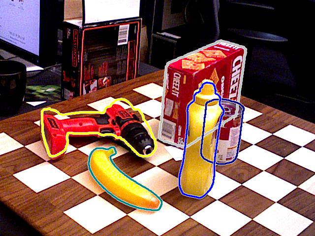
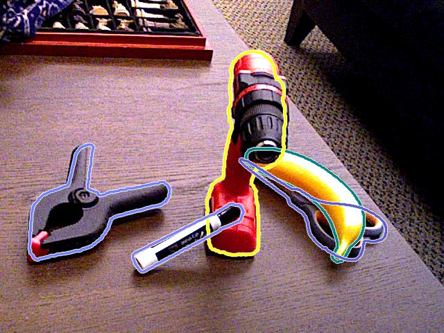
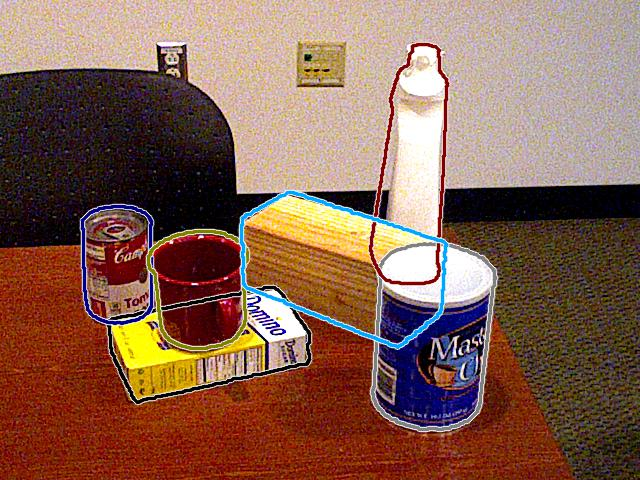

# Component Structure and Pose Estimation DNN Improvements

_DATE : June 30, 2020_

In this post, I discuss the updates regarding the new structure of pose estimation and grasping components and the introduced improvements over `Segmentation-driven 6D Object Pose Estimation`.

## Component Structure

After spending time understanding the new [CORTEX](https://github.com/robocomp/dsr-graph) software architecture and its implementation, I started planning the workflow of pose estimation and grasping components. Since this is a new architecture, I had to spend time understanding the infrastructure and asking my mentor, who was very helpful and responsive. After few days of discussing it with my mentor, I had a solid understand of the structure and implementation.

Figure(1) : Complete schema for grasping and pose estimation workflow.

As shown in the figure, the components workflow goes as follows :

-   `ViriatoPyrep` component streams the RGBD signal from CoppelaSim simulator using PyRep API.

-   `objectPoseEstimation` component receives RGB signal from `ViriatoPyrep` component and performs pose estimation through `Segmentation-driven 6D Object Pose Estimation` DNN.

-   `objectPoseEstimation` component, then, passes the output poses to `objectPoseEstimationPub` component, which publishes the poses to the shared memory in `ViriatoDSR`.

-   `Grasping` components stream the poses from the shared memory and use it to plan a grasp on the object.

For more information about components' specifications and interfaces, refer to [grasping repo](https://github.com/robocomp/grasping/blob/master/components/README.md).

## Component Implementation

Once I had a complete structure of the components workflow, which I had discussed with my mentor, I started implementing the pose estimation component, while the `Segmentation-driven 6D Object Pose Estimation` network is being trained.

I need to implement two components, which are `objectPoseEstimation` and `objectPoseEstimationPub`. I decided to start with `objectPoseEstimation`, as it's the main pose estimation driver and it doesn't interact directly with `ViriatoDSR`. As discussed, it receives an RGB image from `ViriatoPyrep`, runs the network inference on it and then passes the predicted poses to `objectPoseEstimationPub` component to be pushed to the shared memory.

Fortunately, the implementation of `objectPoseEstimation` component wasn't very difficult, thanks to _RoboComp_ modular code generator. Also, I have created some interface functions to be able to easily run network inference on any image. So, I have completed the component implementation, however it's not yet tested properly.

The implementation of `objectPoseEstimation` component can be found [here](https://github.com/robocomp/grasping/tree/master/components/objectPoseEstimation).

## Network Description

Now, before discussing our network improvements, let's have a quick look at the network architecture.

Figure(2): Network diagram from original paper.

A brief description of network :

1)  The input to the network is a simple RGB image.
2)  The network has an encoder of Darknet-53 from YOLOv3, which is used for feature extraction of input image.
3)  The network, then, has two streams :
    -   Segmentation stream : to produce the output segmentation masks (pixel-wise object classification).
    -   Regression stream : to get 2D keypoints corresponding to the 3D keypoints of the object in the world (object) frame. Usually, the keypoints are 8 vertices of the 3D bounding box.
4)  The output 2D keypoints are used to solve a 2D-3D correspondance problem with the 3D keypoints, using RANSAC-based PnP to get object pose (extrinsics), knowing the camera intrinsics. Also, the segmentation masks are used to define object class.

## Network Improvements

After testing the trained network on the augmented dataset, I found out that the network performance is very poor on new objects. Also, the network performance on YCB-Videos dataset objects isn't as expected. Moreover, I noticed that the segmentation loss during training saturates earlier than other losses (pose loss and confidence loss). 

Here are my proposed causes and potential solutions for each problem :

1)  Regarding segmentation loss, I proposed using focal loss, instead of normal crossentropy loss. Focal loss is a dynamically-weighted crossentropy loss. Its usage is proposed by the original paper, too.

2)  Regarding poor performance on new objects, I thought that was due to textureless objects, which can be a problem in feature extraction using Darknet-53 backend.

So, I implemented focal loss for segmentation and tuned some hyperparameters, then gave the network a quick re-train. The segmentation loss didn't saturate anymore and the network performance improved on YCB-Videos dataset objects.

Next, I will try training on augmented dataset with textured new objects and explore further improvements.

## Results

Now, let's explore pose estimation results on YCB-Videos dataset after using focal loss and hyperparameter tuning.

Figure(3) : Results of pose estimation on YCB-Videos dataset.

Figure(4) : Results of pose estimation on YCB-Videos dataset.

Figure(5) : Results of pose estimation on YCB-Videos dataset.

Figure(6) : Results of pose estimation on YCB-Videos dataset.

## Important Dates

- __June 29, 2020 :__

Complete initial implementation of `objectPoseEstimation` component.

Commit : https://github.com/robocomp/grasping/commit/de51bd6271ac84e7d3e207a4fb3843f057813941

## Upcoming Work

-   Train `Segmentation-driven 6D Object Pose Estimation` network on augmented dataset with textured new objects.

-   Test `objectPoseEstimation` component thoroughly.

-   Implement `objectPoseEstimationPub` component to completely integrate pose estimation to the new _CORTEX_ architecture.

__Mohamed Shawky__