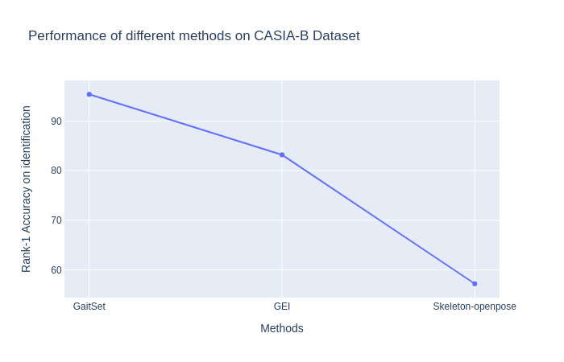

# GSoC'20 RoboComp project: Human recognition (identification) using multi-modal perception system

23rd June 2020
 
### Benchmarking methods for gait analysis 

Gait analysis is study of human motion. It can be used as a soft biometric for human identification. Gait analysis is especially important in the case of long-term human identification where the person has not been seen for months or years. 

Essentially in these cases the appearance of the person will change but the way that person walks can be a strong prior to his identity.      

Two modalities can be used for gait recognition: 

- Silhouette based gait recognition
  1. [GaitSet](https://arxiv.org/abs/1811.06186), AAAI 2019:  

  2. [GEI (Gait Energy Image)](https://ieeexplore.ieee.org/document/1561189), (TPAMI-2005)

- Skeleton based gait recognition
  1. [Skeleton extracted fom openpose](!https://docs.google.com/presentation/d/1PaWISX7MiiflgPgr5fwqaIj4WFN5gD5Q0GeodmvIK_U/edit?usp=sharing) 

**Fig-1. Results on [CASIA-B](!http://www.cbsr.ia.ac.cn/english/Gait%20Databases.asp) dataset, ICIP 2011**

    
*Based on these results, we have choosen **GaitSet** as the gait-recognition model.* 
    
 
[Back To The Top](#table-of-contents)

---

## Current updates on the project
Please follow the following [link](https://colab.research.google.com/drive/1lgx0LabSedQi_3dUnqEgSdRJ3ru95IPq#scrollTo=385kRQXO99h_) for current evaluation of different methods of face recognition and gait recognition. 

---

#### References

> [**Gait-based Person Re-identification: a Survey**](http://users.isr.ist.utl.pt/~alex/papers/aha/Nambiar2019_manuscript.pdf),            
> ATHIRA NAMBIAR and ALEXANDRE BERNARDINO and JACINTO. C. NASCIMENTO,       

> [**Human Identification Based on Gait Analysis: A survey**](https://ieeexplore.ieee.org/document/8566368),            
> Ramiz Görkem Birdal ; Ahmet Sertbaş ; Bilgisayar Mïhendisliği,       
>  3rd International Conference on Computer Science and Engineering([DOI 10.1109](https://doi.org/10.1109/UBMK.2018.8566368))

---
Shubh Maheshwari