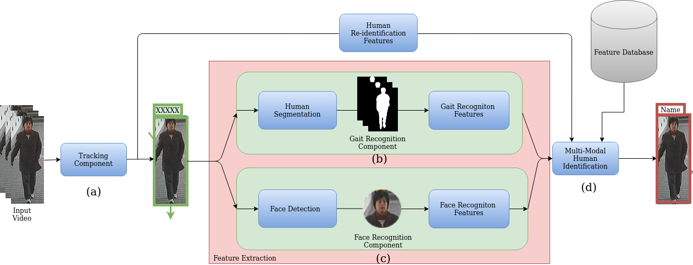

# GSoC'20 RoboComp project: Human recognition (identification) using multi-modal perception system

4th June 2020
 
## About me
 
I am Shubh Maheshwari, in my final year at IIIT-H. I am intrested in Machine Learning, Computer Vision, Graphics. I am doing honors under [Prof. C.V. Jawahar](https://faculty.iiit.ac.in/~jawahar/). I have also been teaching assistant for SMAI (Statistical Methods In AI) and Optimization Methods. 

I created a tour guide robot for our lab. The agent was able to track, tell jokes and interact with users. Currently, I am working on skeleton-based action recognition & synthesis. 

---

## About the Project

In Robotics, it is crucial to identify humans and efficiently distinguish them. This gives the ability to perform further challenging tasks such as personalized interactions, social navigation and surveillance. Currently, Robocomp only uses face recognition for human identification. The aim of this project is to integrate other modalities, such as rgb image, skeleton-based pose, and silhouette of the body. Using these modalities, different human identification components (such as gait recognition & person re-identification) will be evaluated. Finally a multi-modal pipeline will be created to integrate these components into Robocomp.

**Fig-1. Pipeline for human identification. (a) Detect humans and assign them a tracking id. (b) Segment human and extract gait features (c) Detect face and extract features (d) Combine features & search identity from the database.**

### Technologies
As shown in figure-1, 3 seperate techniques capture different modalites of the input video.

a) **[Multi-Person Tracking Component](./post04.md)** 
    
This component detects persons at every rgb frames. Then it associates them with humans detected in previous frames. Thus, it tracks humans present and assign them a tracking id(eg. XXXXX). This is also essential for short-term human identification. 

b) **[Gait Recognition Component](../post03.md)** 

Gait analysis is a soft biometric for long-term human identification. The segmentation mask for every human is extracted and stored across several frames. Based on the walking pattern, a deep learning model extractes features for recognition.  

c) **[Face Recognition Component](./post02.md)** 

Face recognition is the most widely used method for human-identication. First step is to detect the face followed by extracting features using a deep learning model.

d) **[Multi Modal Human Identification Component](./post05.md)**

This component will make a call to different components, combine their features and search the database/gallery to identify the person. If no person is identified, the data is added to the gallery as an *unknown person*.  

[Back To The Top](#about-the-project)

---

Shubh Maheshwari
